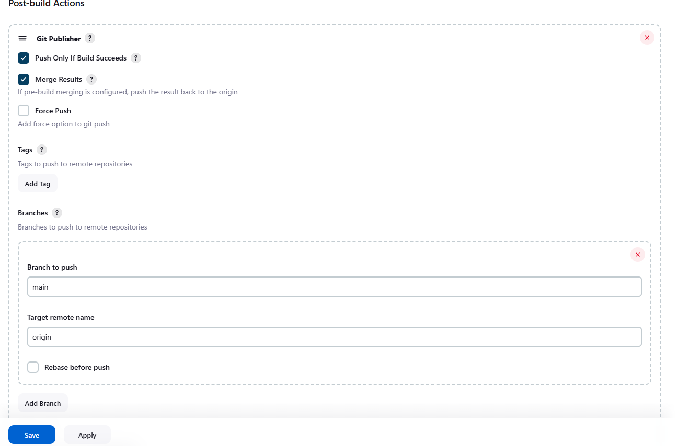

## **Step 1: Create a New Jenkins Job**

1. Go to **Jenkins Dashboard > New Item**.
2. Choose **Copy from** and give it a name.
3. select the Project you want to copy from
4. Click **OK**.

## Configurations have been copied from selected job.

1. Change description of job.

### **2. Build Triggers**
- Check **Poll SCM** or **GitHub webhook trigger** for automated execution.

### **3. Build Steps**
1. get rid of any build steps 

### **4. Post-build Actions**
1. Select Git Publisher 
2. check box : 'Push Only If Build Succeeds'
3. Check box: 'Merge Results'
4. Select 'Add Branch' 
5. Branch to push: enter 'main'
6. Target remote name: enter 'origin'
    
    
7. Click save.
---
### **5.Go to previous project and select configure **
1. Go to Previous job 
2. Select configurations tab
3. Scroll down to post build steps 
4. select 'build other projects'
5. select Merge job as the downstream project in 'Projects to build' tab
6. click save.

    

## ** 6: Make changes to code then use git push to trigger Job 1**

