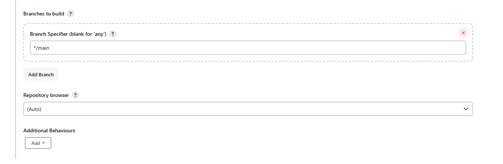
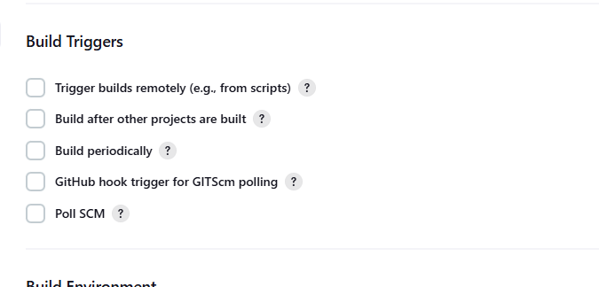
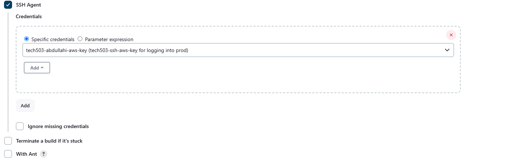
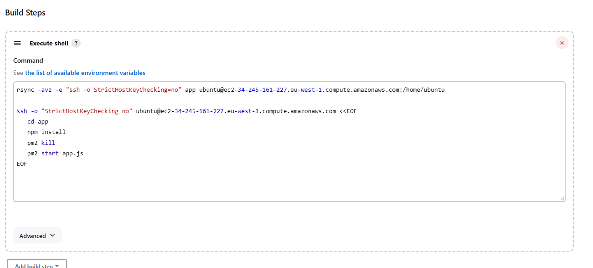

## **Step 1: Create a New Jenkins Job**

1. Go to **Jenkins Dashboard > New Item**.
2. Choose **Copy from** and give it a name.
3. Select the project you want to copy from. This helps in reusing existing configurations, saving time and maintaining consistency.
4. Click **OK**.

## **Configurations have been copied from the selected job.**

1. Change the description of the job to reflect its new purpose.

### **2. Change Build Branch Back to Main**
  1. Scroll to 'Branches to build' and change 'Branch Specifier' from '*/ dev' to '*/main'. This ensures that the job builds the production-ready `main` branch instead of a development branch.

  

### **3. Build Triggers**
- Uncheck **Poll SCM** or **GitHub webhook trigger** for automated execution. Since we are manually triggering the build or chaining it with another job, automatic triggers may not be necessary.
  
  

### **4. Log into AWS**
1. Create an EC2 instance to host your application.
   1. Create from App AMI (Amazon Machine Image) for a pre-configured environment.
   2. Leave security groups and network configurations as default unless specific changes are required for security or performance.

### **5. Add SSH Agent**
1. Check **SSH agent** in the build environment to allow Jenkins to connect to remote servers.
2. Check 'Specific credentials' to specify which SSH key Jenkins should use.
3. Add a private SSH key and give it a description to ensure secure authentication with the EC2 instance.

   

### **6. Build Steps and Post Build Actions**
1. Remove any build steps and post-build actions from the previous job to start fresh. This prevents unintended actions from carrying over from the copied job.

### **7. Build Steps**

1. Select 'Execute shell' in the build steps dropdown tab.
2. Add shell commands to allow Jenkins to connect to your EC2 instance:
   1. Add the instance IP address/DNS so Jenkins knows where to connect.
   2. Add the app directory so Jenkins knows where to navigate.
   3. Add commands to execute within the app folder, such as deployment scripts or configuration updates.

   

   4. Click **Save**.

### **8. Post Build Steps - Connect to Merge Job**

1. Go to the previous Merge job.
2. Select the **Configurations** tab.
3. Scroll down to **Post Build Steps**.
4. Select 'Build other projects'.
5. Select **CDE** as the downstream project in the 'Projects to build' tab. This ensures that once the current job finishes successfully, it triggers the CDE job automatically.
6. Click **Save**.

   [alt text](../Pictures/Jenkins/jenkins-add-cde-to-job2.png)

## **9: Make Changes to Code Then Use Git Push to Trigger Job 1**
After making changes to the code, pushing it to the repository will trigger the first Jenkins job, starting the CI/CD process and ensuring the changes are deployed efficiently.

