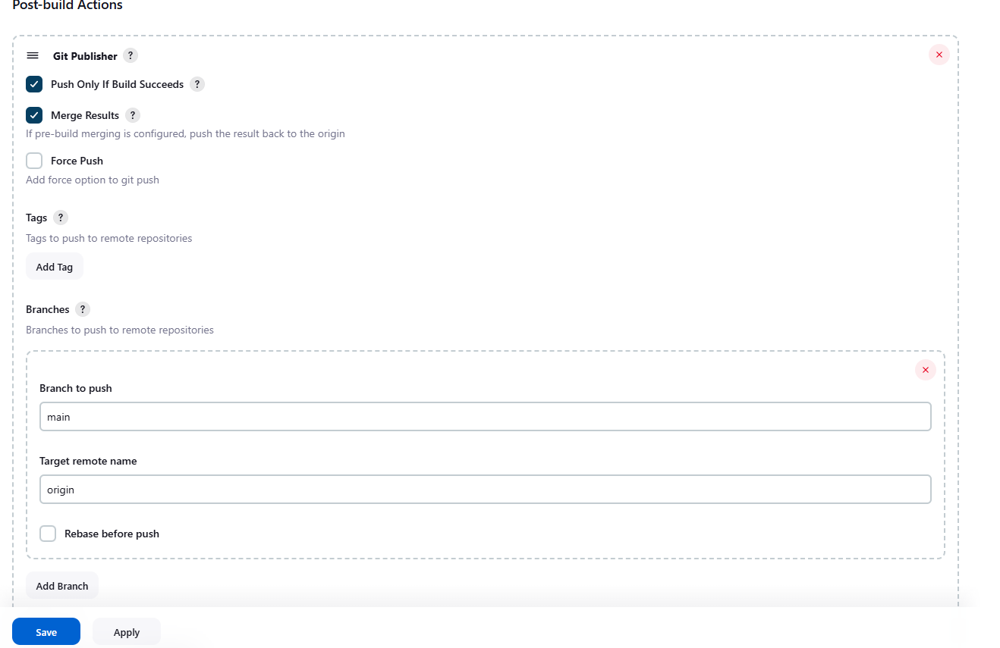
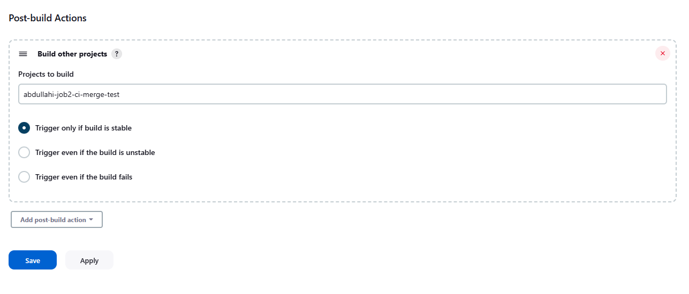

## **Step 1: Create a New Jenkins Job**

1. Go to **Jenkins Dashboard > New Item**.
2. Choose **Copy from** and give it a name.
3. Select the project you want to copy from. This helps in reusing existing configurations, saving time and maintaining consistency.
4. Click **OK**.

## **Configurations have been copied from the selected job.**

1. Change the description of the job to reflect its new purpose.

### **2. Build Triggers**
- Check **Poll SCM** or **GitHub webhook trigger** for automated execution. This ensures that Jenkins automatically triggers the job when changes are pushed to the repository, enabling continuous integration.

### **3. Build Steps**
1. Get rid of any build steps. This allows a clean slate, ensuring that no unnecessary steps from the copied job interfere with the new configuration.

### **4. Post-build Actions**
1. Select **Git Publisher** to allow Jenkins to push changes back to the repository.
2. Check the box: **'Push Only If Build Succeeds'** to ensure that only successful builds are merged, preventing broken code from being pushed.
3. Check the box: **'Merge Results'** to integrate the changes into the main branch after a successful build.
4. Select **'Add Branch'** to specify where the merged changes should go.
5. In **Branch to push**, enter `'main'`. This ensures that all successful builds are merged into the production branch.
6. In **Target remote name**, enter `'origin'`. This specifies the remote repository where the changes should be pushed.

    

7. Click **Save**.

---
### **5. Go to Previous Project and Select Configure**
1. Go to the previous job.
2. Select the **Configurations** tab.
3. Scroll down to **Post-build Steps**.
4. Select **'Build Other Projects'** to trigger another job after this one completes.
5. Select **Merge Job** as the downstream project in the **'Projects to Build'** tab. This ensures that after the first job completes, the merge job runs automatically, integrating the changes.
6. Click **Save**.

    

## **6: Make Changes to Code Then Use Git Push to Trigger Job 1**
Once code changes are made and pushed to the repository, Jenkins will detect them (if configured with Poll SCM or a webhook) and trigger **Job 1** automatically, starting the CI/CD pipeline.

