1. Access Jenkins Dashboard
    - Open your browser and go to the Jenkins URL (default: http://localhost:8080). Assuming you're running Jenkins on a VM. 
    - Log in using your administrator credentials.
    
2. Navigate to New Item:
    - On the Jenkins dashboard, look for the "New Item" link in the left sidebar and click it.
   
    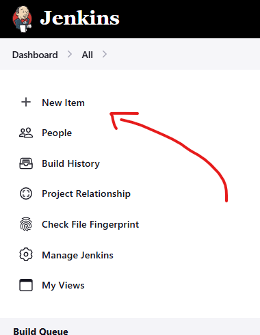

3. Choose a Job Type: You will be prompted to enter a name for your job and select the type of job to create.

- Choose from the following options (most common ones):

    - Freestyle Project: A simple, flexible job type that allows you to run commands, manage source code, or run tests.

    - Pipeline: Use this type if you want to define your build process as code (using Jenkins Pipeline DSL).

    - Multibranch Pipeline: A job that automatically discovers branches of your repository and runs pipelines on them.

    - Other types are available depending on your needs (such as Build flow, External jobs, etc.).

- For a basic example, select Freestyle Project and click OK.
    
    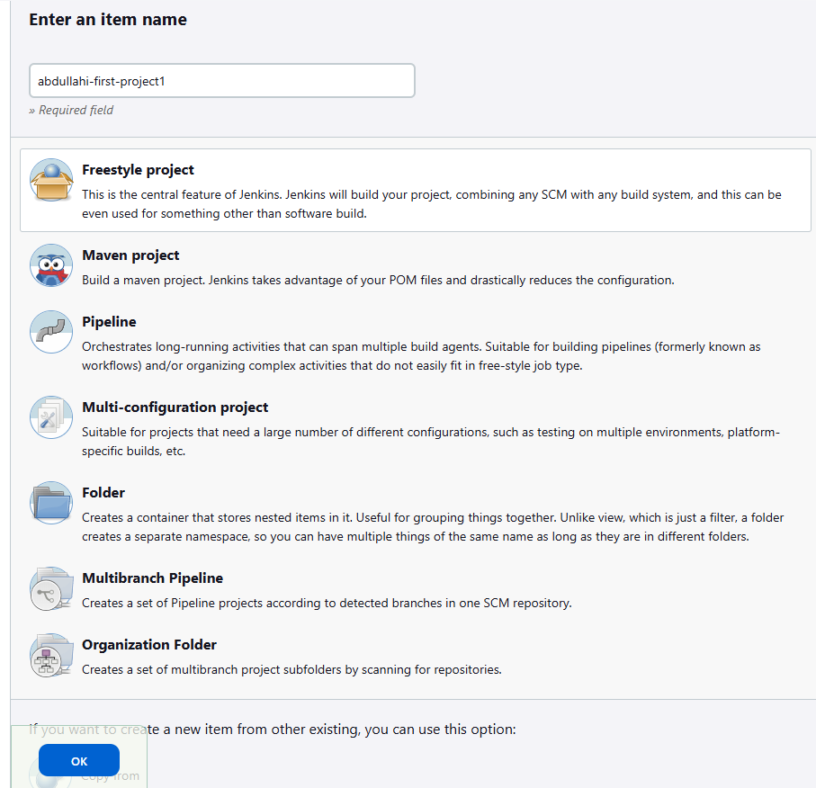

4. Configure the Job - Once you create the job, you’ll be taken to the configuration page, where you’ll define how the job runs.
   1. General Information:
        - Description: Optionally, you can add a description for your job (helps others understand its purpose).
    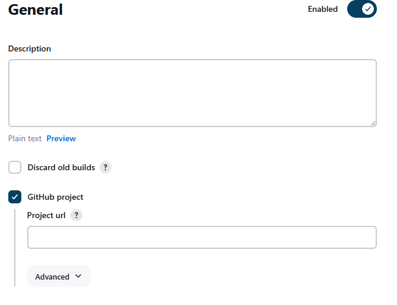

   2. Add GitHub Project: 
        - Enter URL of GitHub repository 
   3. Create SSH Key and deploy key in Github 
        - Create SSH Key in Bash terminal using command: ssh-keygen -t rsa -b 4096 -C "placeholder@hotmail.com"
        - Go to repository settings, find deploy keys in the security tab on the left hand side. Give your key a name and paste the contents of your PUBLIC KEY into the key section and make sure to allow write access!
    
    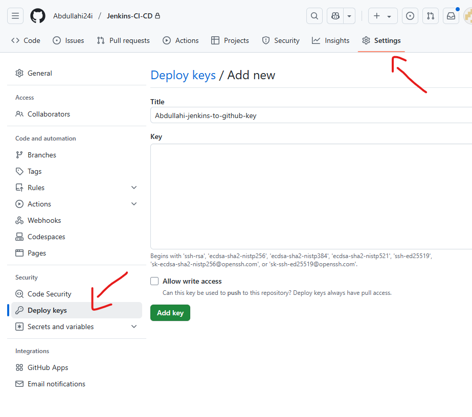

   4. Source Code Management: If you're pulling code from a repository (like GitHub or Bitbucket), configure the Source Code Management section:
        - Select Git or another SCM system.
    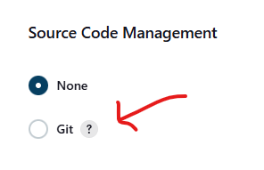

        - Provide the repository URL (HTTP/SSH).
        - Enter the credentials if required (you can add them through Jenkins if you haven’t already).
        - Where it says Private key select 'Enter Directly', select 'Add' then copy and paste your private SSH key with no spaces.  
    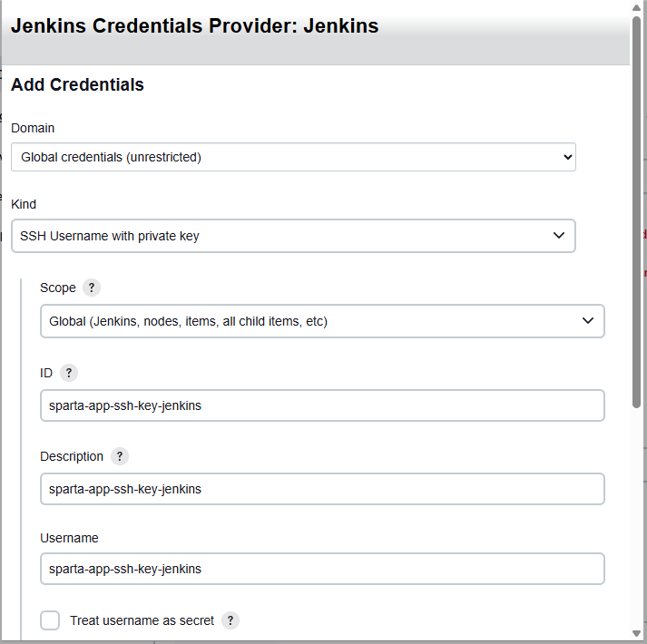
    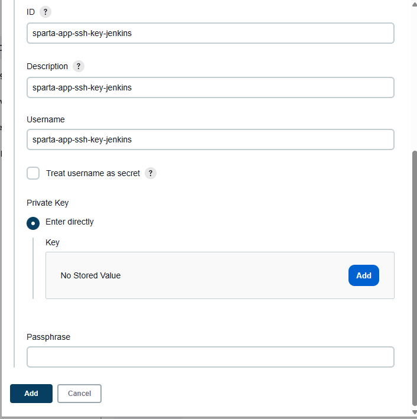
   
   5. Configure Branches to Build: 
        - Change from 'master' to 'main'
    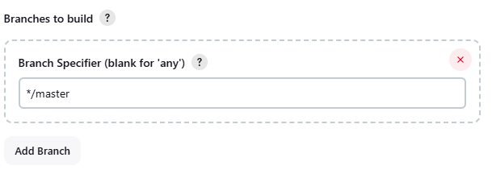

   6. Build Triggers: This section defines when the job should be triggered.

        - Build periodically: Set up a cron-like schedule for regular execution.

        - GitHub hook trigger for GITScm polling: Trigger the build when there’s a change in the repository.

        - Poll SCM: Poll the repository for changes at specified intervals.
    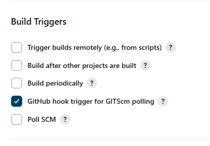

   7. Build Environment: If you need to set up environment variables or other parameters before running the build, you can configure this here. These can be things like having Node installed.
        - Here we will select 'Provide Node & npm bin/ folder to PATH.

    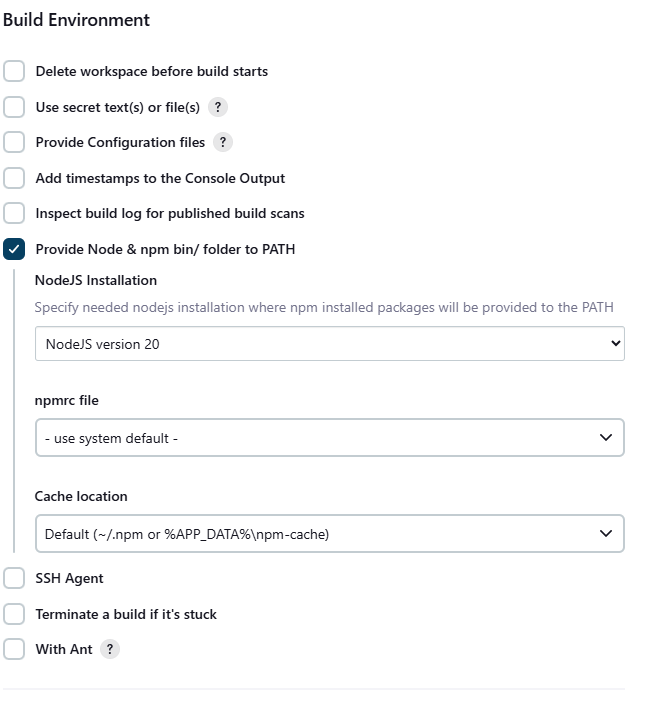

   8. Build Steps: This is where you define what the job does during the build. Common build steps include:

        - Execute Shell: Run shell commands (e.g., build scripts) 
        - Select 'Add build step' the select 'Execute shell'
        - Enter your shell commands 
    
    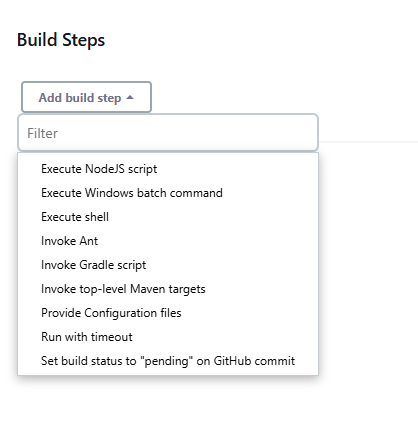

    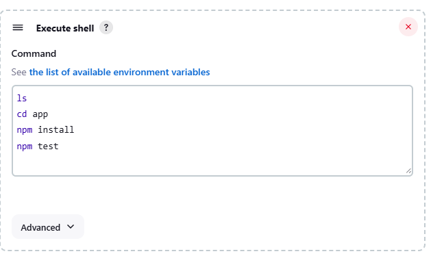

5. Click save.

6. To Add a webhook
   1. Go to your GitHub repository and go to settings
   2. In the 'Code and automation' tab on the left select 'Webhooks'
   3.  Select 'Add Webhook'. 
    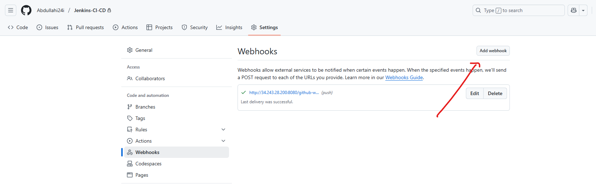
   
   4. In 'Payload URL enter: http://<localhost IP>:8080/github-webhook/
   5. Select disable SSL verification 
   6. Select 'Just push event'

    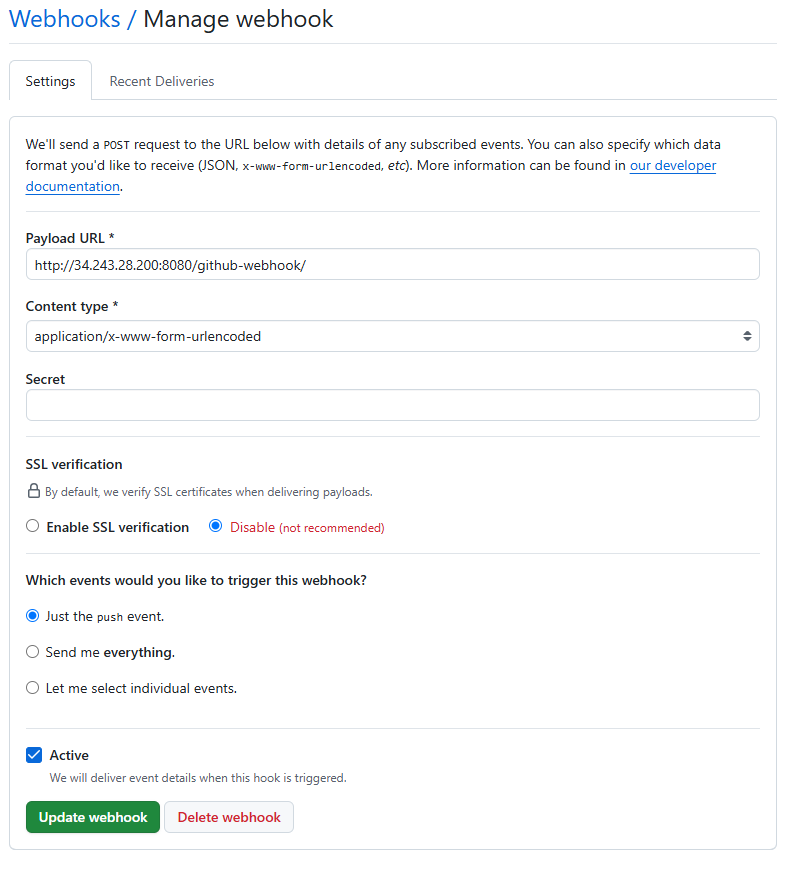

    