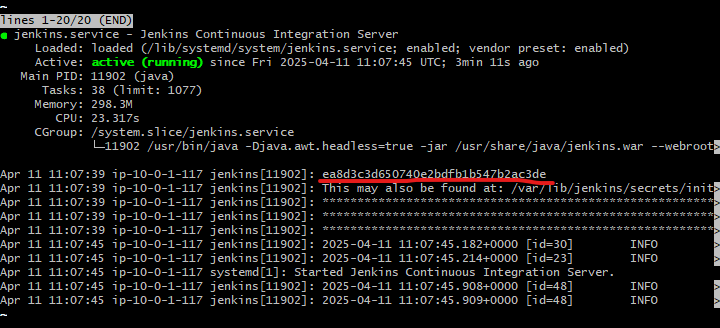
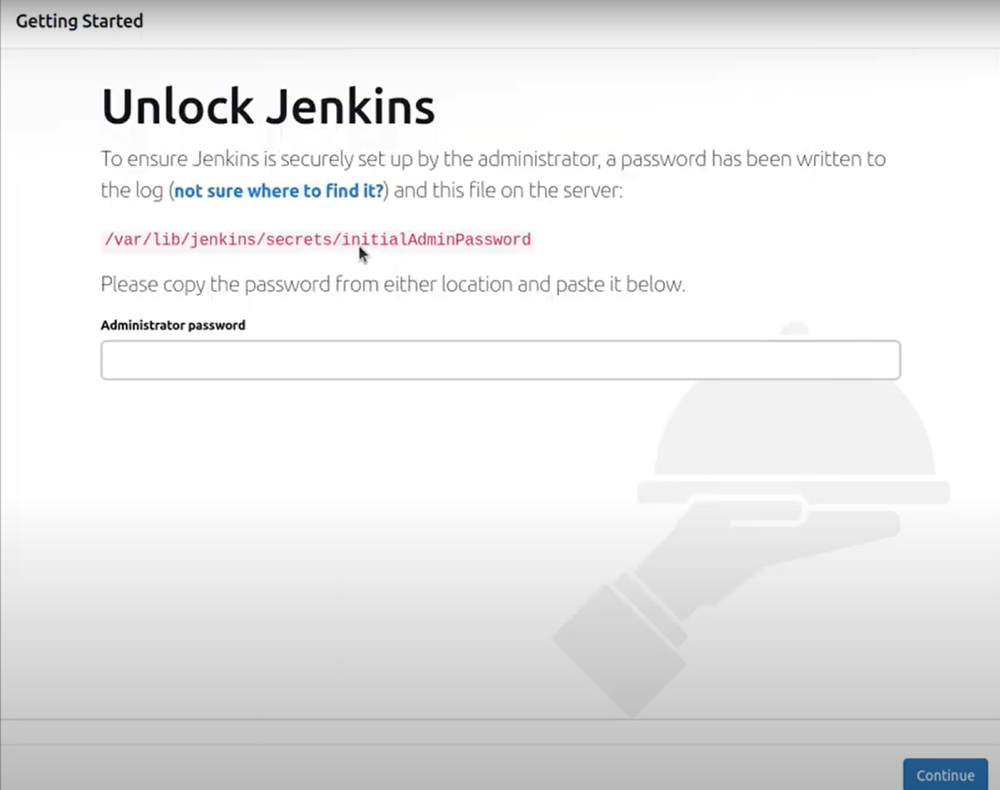
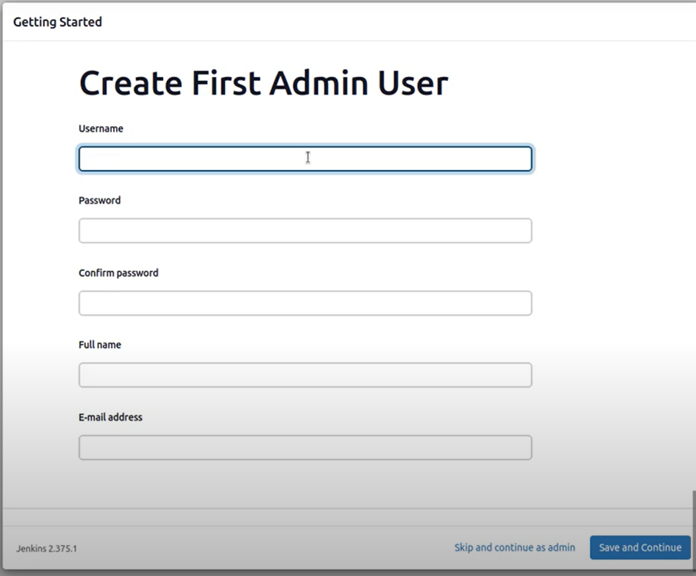
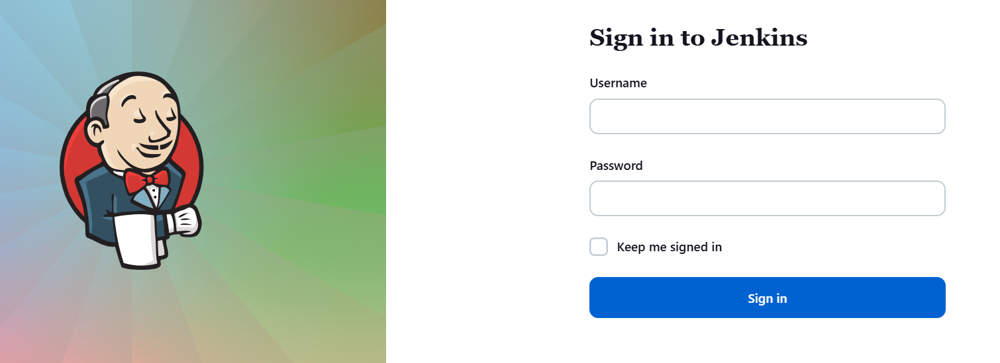
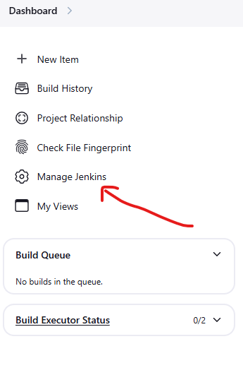
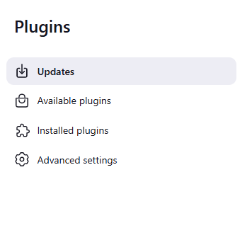
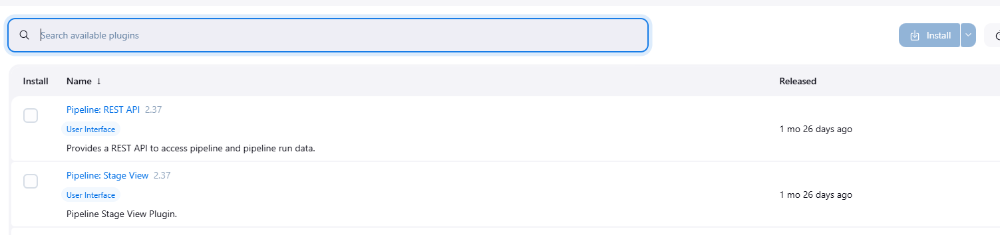
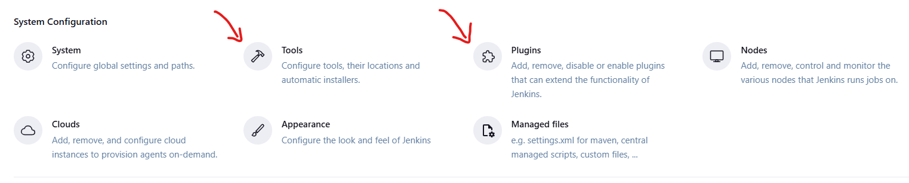
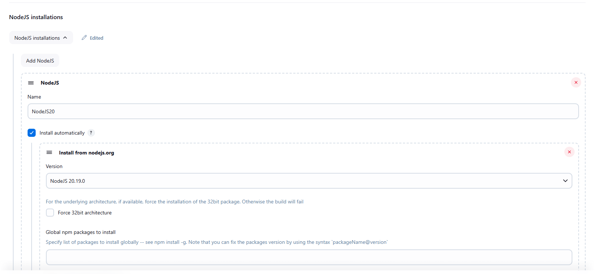
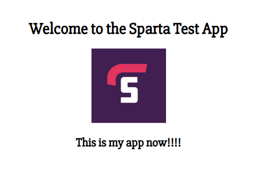

### 1. Create and configure a new VPC

1. Create VPC
2. Create Subnet - make sure you create a public subnet and select an AZ
3. Create Internet Gateway and connect it to VPC
4. Associate Subnet to Internet Gateway 
5. Create an EC2 instance with Ubuntu 22.04 
6. Create a security group that allows access to port 8080, HTTP, and SSH


### 2. Connect to instance and run commands listed in 'install-jenkins.sh' 
```
#!/bin/bash

sudo DEBIAN_FRONTEND=noninteractive apt update -y

sudo DEBIAN_FRONTEND=noninteractive apt upgrade -y

## **Step 2: Install Java (Required for Jenkins)**
sudo DEBIAN_FRONTEND=noninteractive apt install openjdk-17-jdk -y

# Verify the installation:
java -version

## **Step 3: Add the Jenkins Repository and Key**
## To install the latest stable Jenkins version, add its official repository:
sudo wget -O /usr/share/keyrings/jenkins-keyring.asc \
  https://pkg.jenkins.io/debian-stable/jenkins.io-2023.key

## Add the repository:
echo "deb [signed-by=/usr/share/keyrings/jenkins-keyring.asc]" \
  https://pkg.jenkins.io/debian-stable binary/ | sudo tee \
  /etc/apt/sources.list.d/jenkins.list > /dev/null
## Update package lists:
sudo DEBIAN_FRONTEND=noninteractive apt update -y

## Now install Jenkins with:
sudo DEBIAN_FRONTEND=noninteractive apt install jenkins -y

## Start the Jenkins service:
sudo systemctl start jenkins

## Enable it to start on boot:
sudo systemctl enable jenkins

## Check its status:
sudo systemctl status jenkins
```

### 3. Copy Instance IP and paste into browser with port ---> localhost:8080


### 4. Log into Jenkins with Administrator password.
   1. Copy Password from the terminal



   2. Then create Admin Account with username password and email address
    


   3. Create First Admin User with new username and Password



   4. Log into Jenkins with new credentials.




### Install Plugins for Jenkins

   1. Go to Manage jenkins 




   2. Scroll down to plugins 
   3. Select 'Available plugins' 
   
   
   
   4. Search Plugins you need and install
   

   
   
   5. install NodeJS,Git,SSH Agent
    
### Add Tools 
  
   1. Go to Manage jenkins 
   2. Scroll down to Tools

   
   
   3. Find tools you want to install such as NodeJs
   4. select version and give it a Name.




### Configure Job 1 to install app, build and test 
   
1. See Jenkins-jobs.md
2. make sure to update webhook to new localhost 


### Configure Job 2 to Merge local push changes from dev branch to main branch

1. See Jenkins-CI-Merge.md 

### Configure Job 3 to connect to EC2 instance, start app and update changes 

1. See Jenkins-CDE.md 


### Output should be what you changed in the file you pushed to trigger the pipeline.


