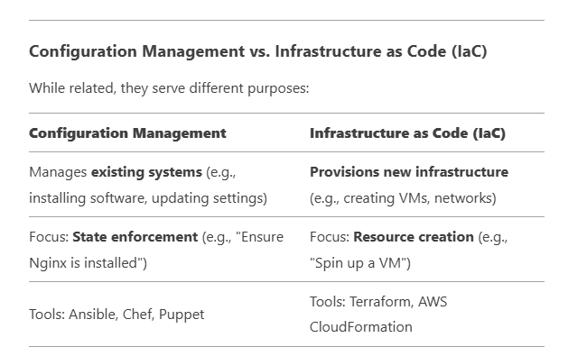
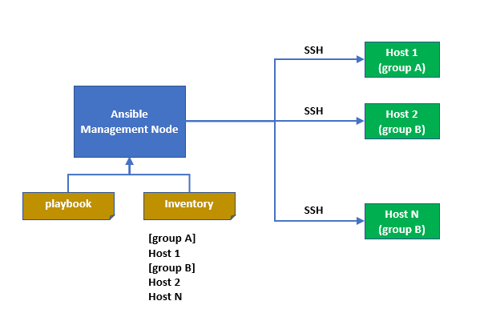

### What is Infrastructure as Code (IaC)
Infrastructure as Code (IaC) is the practice of managing and provisioning computing infrastructure (servers, networks, databases, etc.) using machine-readable definition files (code) rather than manual processes or interactive configuration tools (Codifying ClickOps).

With IaC, you define your infrastructure in configuration files (written in languages like YAML, JSON, or domain-specific languages like HCL for Terraform), which can be version-controlled, reused, and automated.

#### Key Benefits of IaC
- Automation – Eliminates manual setup, reducing human error.
- Consistency – Ensures identical environments every time.
- Version Control – Track changes via Git, enabling rollbacks.
- Scalability – Easily replicate infrastructure across environments (dev, staging, prod).
- Cost Efficiency – Reduces wasted resources by automating provisioning and teardown.
- You can describe the end state with Declarative or Imperative approach.

### What is Configuration Management?
Configuration Management (CM) in cloud computing refers to the process of systematically handling changes to a system’s configuration (servers, applications, networks) to maintain consistency, performance, and security over time. It ensures that all cloud resources are correctly configured, compliant with policies, and operate as intended.

#### Key Goals of Configuration Management
- Consistency – Ensure all environments (dev, staging, prod) match defined configurations.
- Automation – Replace manual setups with automated scripts/tools.
- Compliance – Enforce security policies and regulatory standards (e.g., HIPAA, PCI-DSS).
- Tracking & Auditing – Log changes for accountability and troubleshooting.
- Scalability – Manage configurations across hundreds or thousands of servers.

### What is Orchestration?
Orchestration refers to the automated coordination and management of complex workflows across multiple systems, services, or containers to ensure seamless deployment, scaling, and operation of applications. It ties together provisioning (IaC), configuration management, and runtime operations into a unified, automated process.

#### Key Goals of Orchestration
- Automate Workflows – Deploy, scale, and manage applications with minimal manual intervention.
- Ensure High Availability – Automatically recover failed services.
- Optimize Resource Usage – Efficiently distribute workloads across servers.
- Manage Dependencies – Coordinate services that rely on each other (e.g., databases + microservices).

#### Why Orchestration Matters
- Speed: Deploy applications faster with repeatable workflows.
- Reliability: Reduce human error in complex deployments.
- Scalability: Handle thousands of containers/nodes effortlessly.
- Cost Efficiency: Auto-scale resources to match demand.

### What is Ansible? 
Ansible is an open-source automation tool used for configuration management, application deployment, infrastructure provisioning, and task automation. It simplifies IT operations by allowing administrators to define system configurations and workflows as code (typically in YAML), which can be executed across multiple servers or cloud environments.

#### Key features of Ansible

- Agentless Architecture
  - Uses SSH (Linux) or WinRM (Windows) to communicate with nodes—no need to install extra software on managed hosts.

- Idempotent Operations
  - Runs tasks repeatedly without causing unintended side effects (e.g., skips installing software if already present).

- Declarative Language (YAML)
  - Defines "desired state" rather than writing procedural scripts.

- Modules & Playbooks
  - Modules (small programs for tasks like installing packages, managing files).
  - Playbooks (YAML files defining automation workflows).

- Extensible & Integrates with DevOps Tools
  - Works with Docker, Kubernetes, AWS, Azure, Terraform, Jenkins, etc.

#### Advantages of Ansible
- Simple to Learn (YAML syntax).
- No Agents (uses SSH/WinRM).
- Large Community & Ecosystem (Ansible Galaxy for pre-built roles).
- Cross-Platform (Linux, Windows, network devices).

#### Disadvantages of Ansible
- Not Ideal for Real-Time Systems (push-based, not event-driven).
- Limited Performance at Scale (slower than agent-based tools like Puppet for 1000s of nodes). 

### How does Ansible work?
1. Control Node (where Ansible is installed) sends commands to managed nodes.
2. Inventory File lists all target machines (hosts).
3. Playbooks define automation tasks (e.g., install Nginx, configure users).
4. Modules execute tasks on remote systems.

