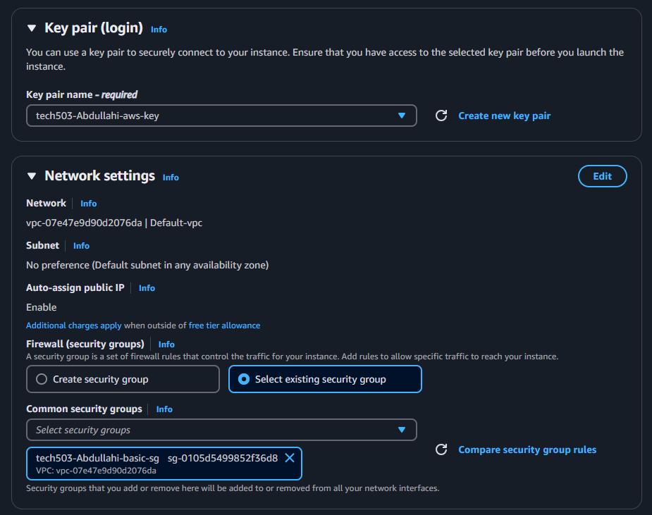

1. Go to the AWS Management Console and navigate to EC2 service and find launch templates on the side.
   

2. Click on Create Launch Template.

3. Define Basic Information
   - Launch Template Name – Enter a descriptive name for your template.

   - Template Version Description (Optional) – Provide a description for clarity.

4. Choose an AMI (Amazon Machine Image)

5. Configure Key Pair (For SSH Access) and Configure Security Group

6. Add a Resource Tag to name EC2 instance

7. Go into Additional settings tab and configure user data for your instance.

8. Create launch template 

9. Find launch template in Launch templates section and click actions and launch instance from the template.

