1. In the EC2 Dashboard, scroll down and click on Auto Scaling Groups in the left-hand menu and click Create Auto Scaling Group.
2. Once on the Auto Scaling page click 'Creating Auto Scaling Group 

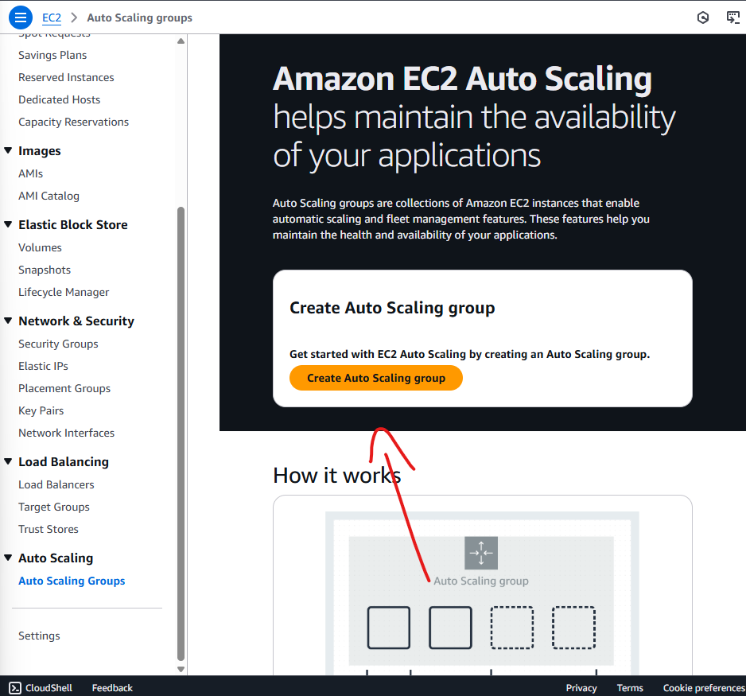

3. Configure a name for your autoscaling group, select your launch template and click next at the bottom of the page 

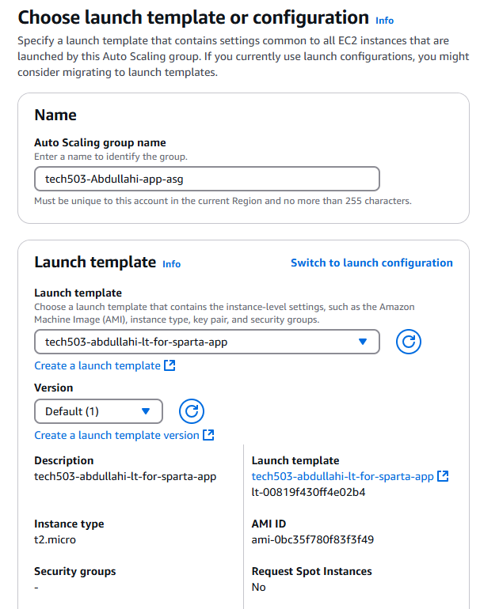

4. Leave the VPC settings to default and Select Availability zones and keep balanced best effort toggeled , then click next.

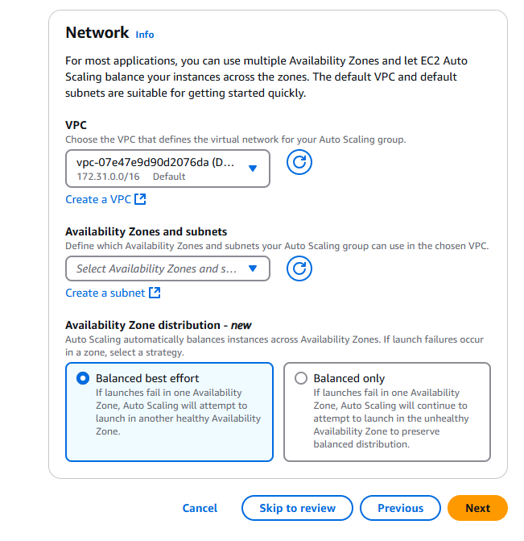

5. Click attach to a new load balancer, and select Application Load Balancer,
6. Change the Load Balancer name
7. Make sure the Application Load Balancer is internet facing.

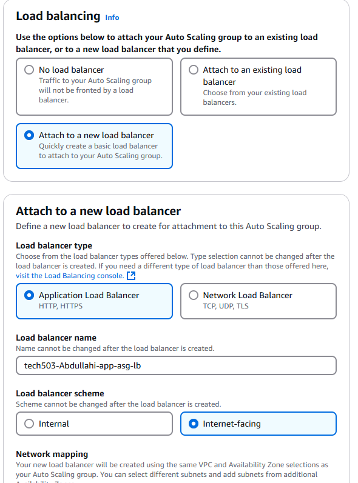

8. Scroll down and create a new target group and add a name.

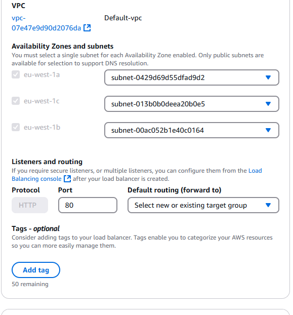

9. Scroll all the way down and select turn on Elastic Load Balancing health Checks then click next.

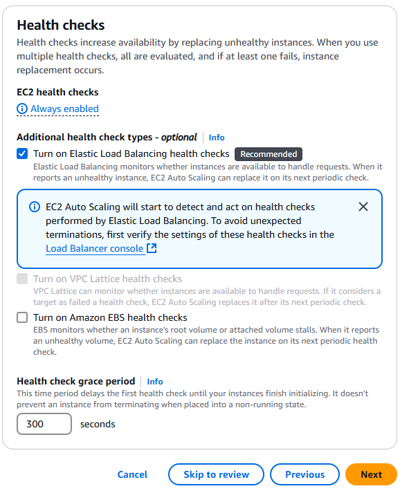

10. Configure desire capacity of EC2 instances 

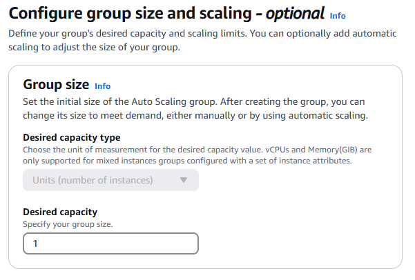

11. Configure minimum and maximum capacity

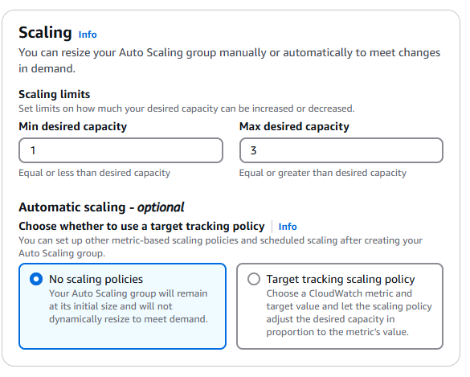

12. Select Target tracking scaling policy and leave the settings as default.

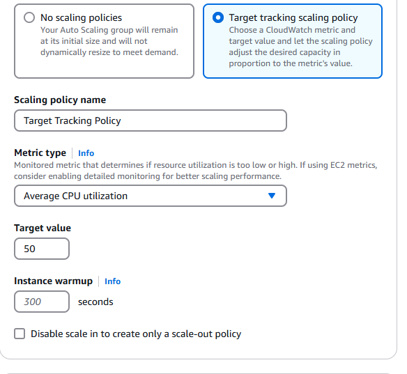

13. Leave instance maintenance policy as NO policy (default)

14. Leave Addition Capacity Settings as 'Default' and scroll to the bottom of the page and click next.

15. On Add Additional Notifications- do not add and click next 

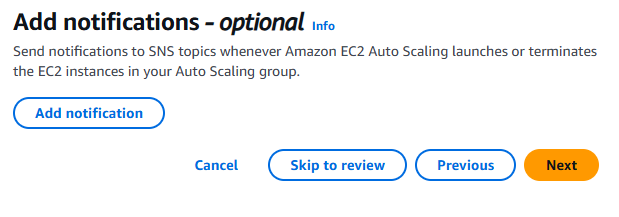

15. Add tags, select add tag and enter name in the 'key' and put the name you want your EC2 instances to have in the 'value' box. then click next in the bottom right hand corner of the screen.

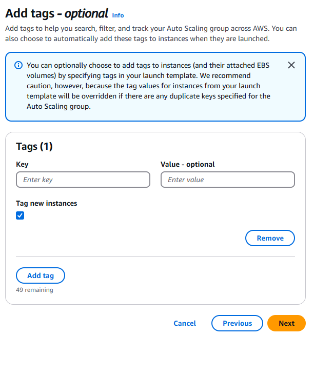

16. Review all of your configurations, scroll to the bottom of the screen, then click 'Create Auto Scaling Group'.

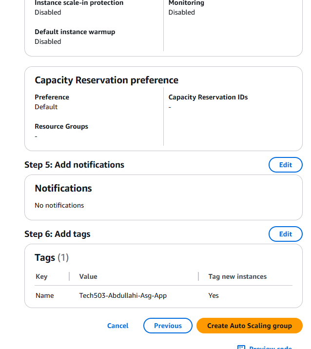
