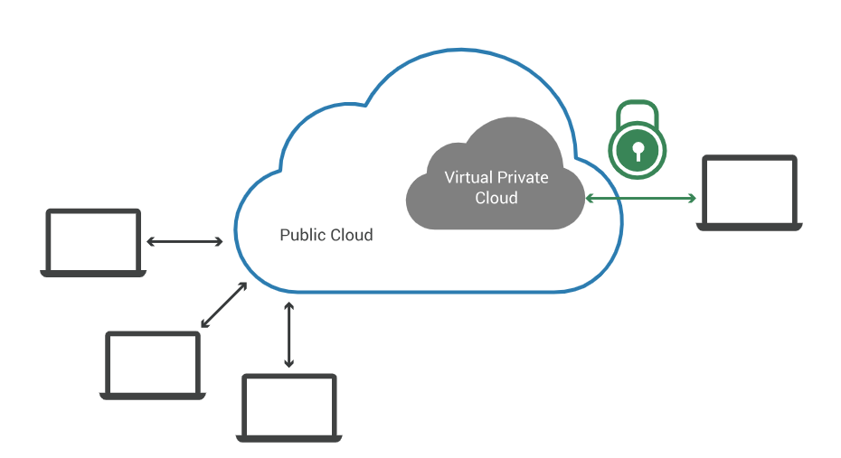
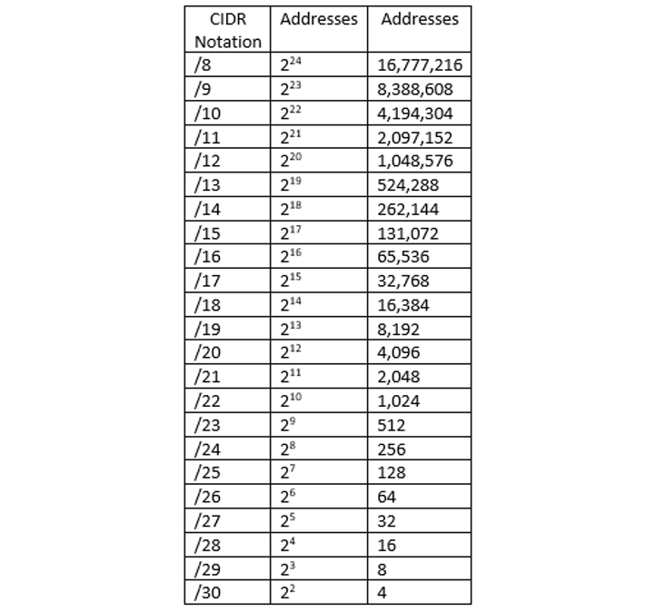
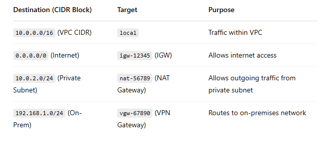

### What are VPCS?

- Imagine a public cloud as a crowded restaurant, and a virtual private cloud as a reserved table in that crowded restaurant. Even though the restaurant is full of people, a table with a "Reserved" sign on it can only be accessed by the party who made the reservation. Similarly, a public cloud is crowded with various cloud customers accessing computing resources – but a VPC reserves some of those resources for use by only one customer.

### VPC Diagram:
- A secure, isolated private cloud hosted within a public cloud

  

### How do VPCs help a business?
- A VPC is a virtual network within a public cloud that allows an organistion to isolate and control its own resources and network infrastructure, offering a secure and private environment for cloud computing.
  
- **Isolation** - create a private, isolated environment within a public cloud, protecting sensitive data and applications from unauthorised access or interference from other cloud users (access and permission control).
- **Granular control** - Businesses can define their own IP address ranges, subnets, route tables, and security rules and network firewalls, giving them precise control over their cloud environment.
- **Compliance** -  VPCs can help businesses meet compliance requirements by providing a controlled environment for data storage and processing. 
-  **Cost** - By isolating resources within VPCs, organizations can optimize resource utilization and reduce costs associated with unnecessary network traffic or security vulnerabilities. 
-  VPCs can be used to launch managed services like Elastic Load Balancing, Amazon RDS, and Amazon EMR, simplifying infrastructure management and reducing operational costs. 

### How do they help DevOps?

- **Enhanced Security** 
  - DevOps teams can define network configurations, including IP address ranges, subnets, routing, and security groups, to control traffic flow and restrict access.
  - VPCs allow the creation of private networks where resources can communicate without exposing them to the public internet, further enhancing security. 

- **Improved Resource Management** 
  - VPCs provide flexibility to configure networks according to specific needs, allowing for efficient resource deployment and management, such as grouping resources in subnets based on function, security requirements and networking needs.
  
- **Automation** 
  - Use Terraform, AWS CloudFormation, or Ansible to create VPCs programmatically this ensures Dev, QA, and Prod environments have the same networking setup.
  - Ensures Dev, QA, and Prod environments have the same networking setup

- **CI & CD Integration**
  - VPCs can be integrated into CI/CD pipelines, allowing for automated deployment of applications and infrastructure changes. 
  -Host AWS services, and tools inside a VPC for secure deployments.

### Why did AWS feel the need to introduce VPCs?
- AWS introduced Virtual Private Clouds (VPCs) to provide enhanced security, network isolation, and better control over cloud-based infrastructure. Before VPCs, AWS ran all EC2 instances in a shared public cloud, which had limitations for businesses needing more privacy, compliance, and control

### Explain:
- **Subnets**
  - A subnet, or subnetwork, is a logical division of a larger IP network into smaller, more manageable segments, each with its own unique IP address range.
  - In AWS, a VPC can have multiple subnets, each assigned to an Availability Zone (AZ).
  - Network Management - Helps segment network traffic based on function, as different departments or locations might need separate network segments. 
  - Reduce congestion by controlling traffic flow.
  - Subnetting can also improve security by isolating different parts of the network, limiting the impact of potential security breaches or network issues to a specific subnet, i.e. private subnet- not accessible to the internet.

- **Public vs Private Subnets** 
  - **Public Subnets** are subnets that have direct access to the internet through an Internet Gateway (IGW). They're typically used for resources like web servers.
  - **Private Subnets** do not have direct access to the internet. They're used for resources that don't need public access, such as databases or application servers.

- **CIDR Blocks** 
  - A Classless Inter-Domain Routing (CIDR) block is a notation that specifies the IP address range for a VPC (e.g., 10.0.0.0/16). It defines the number of available IP addresses in the range
   

- **Internet Gateways (IGW)**
  - : An Internet Gateway allows communication between resources in your VPC and the internet. It’s attached to a VPC and enables public internet access for resources in public subnets.

    

- **Route Table**
  - A Route Table in AWS is a set of rules (routes) that control network traffic within a VPC (Virtual Private Cloud). It determines how data moves between subnets, the internet, and other networks (e.g., on-premises).
  - Each subnet in a VPC must be associated with one route table.
  - Each entry in the table consists of:

    -   Destination (CIDR block): Defines the range of IPs.

    - Target: Defines where traffic should go (e.g., Internet Gateway, NAT Gateway, VPN, another subnet).

    

- **SG and how SGs work on an INSTANCE level**
  - A Security Group (SG) in AWS is a virtual firewall that controls inbound and outbound traffic to EC2 instances and other AWS resources. It acts as a protective shield at the instance level to allow or deny specific types of network traffic.
  - Key Features:
    - Instance-Level Security – Security Groups work at the EC2 instance level, not at the subnet level.
    - Stateful – If an incoming request is allowed, the response is automatically allowed 
    -  Only Allows Traffic, so only allowed traffic is defined
