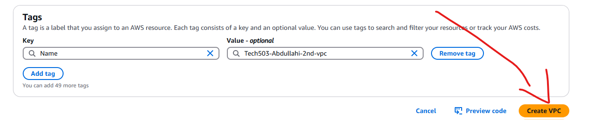
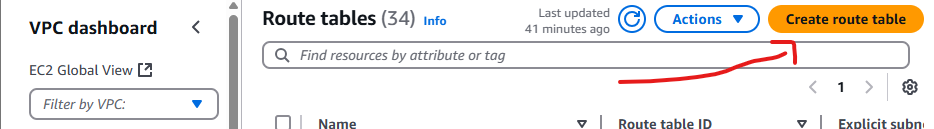
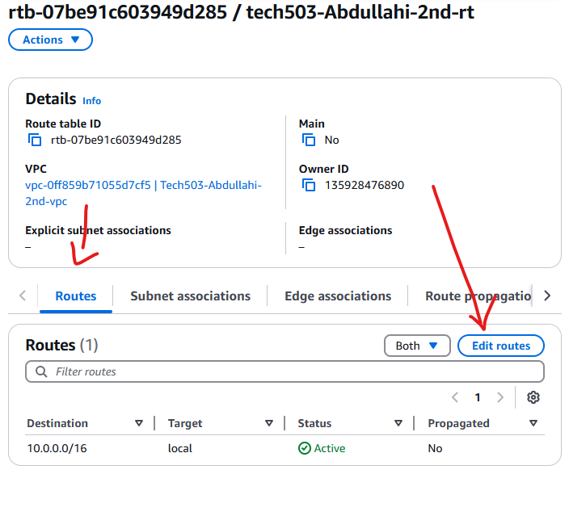
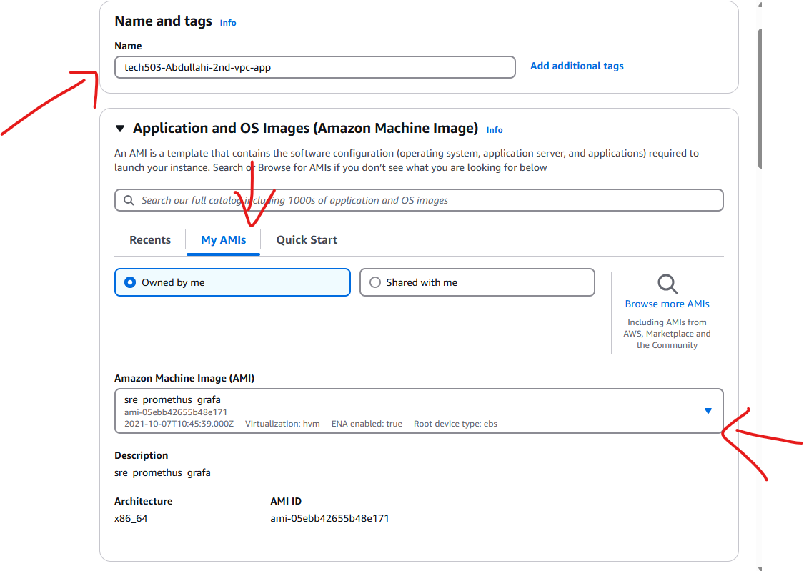

1. **Log in to AWS Management Console** 
2. **Create the VPC**
    1. Go to the AWS Management Console → Navigate to VPC Dashboard by entering VPC in search bar.
    

    2. In the left-hand menu, click "Your VPCs"
    
    3. Click "Create VPC" in the top right hand corner.
    

3. **Configure VPC**
   1. Name your VPC (e.g., MyCustomVPC).
   2. Pv4 CIDR Block: Enter a CIDR block for your VPC (e.g., 10.0.0.0/16 for 65,536 IPs)
   3. IPv6 CIDR Block (Optional): Choose if you need an IPv6 block.
   4. Tenancy: Choose Default (Dedicated tenancy is costlier but isolates hardware).
   
   5. Click "Create VPC". 
    

4. **Create Subnets**
   1. Go to VPC Dashboard (picture in step 2.2) → Click "Subnets" 
   2. Click "Create Subnet"
    
   3. Select your VPC from the dropdown
    
   4. Name the subnet (e.g., Public-Subnet-1)
   5. Choose an Availability Zone (e.g., us-east-1a)
   6. CIDR Block: Define a range within your VPC for your subnet (e.g., 10.0.1.0/24 for 256 IPs).
    
   7. Click "Create Subnet"
    
   
   8. Repeat this process to create additional subnets:
        - Public subnet (10.0.2.0/24)
        - Private subnet (10.0.3.0/24)
   9. Put private subnet in seperate AZ to public subnet.
     
   10. Click 'Create Subnet'

5. **Create Internet Gateway** 
   1. Go to VPC Dashboard → Click "Internet Gateways" (see picture in step 2.2)
   2. Click "Create Internet Gateway"
    
   
   3. Name it (e.g., MyIGW) → Click "Create Internet Gateway"
    
   
   4. Select the newly created IGW, then click "Attach to VPC"
    
   
   5. Choose your VPC and click "Attach Internet Gateway"
    

6. **Create a Route Table**
   1. Go to VPC Dashboard → Click "Route Tables" (see picture in step 2.2)
    
   2. Click "Create Route Table"
    
   3. Name it (e.g., Public-RT)
   
   4. Select your VPC → Click "Create"
    
   5. Click on the newly created route table → Go to the "Routes" tab
    
   6. Click "Edit routes" → "Add Route"
    
   7. Destination: 0.0.0.0/0 (all internet traffic)
   
   8. Target: Choose Internet Gateway (IGW) and select yours in the drop-down tab.
   
   9. Click "Save changes"
    
   10. Click "Subnet Associations" → Click "Edit Subnet Associations"
    
   11. Select the public subnet → Click "Save"
    

7. **Modify Public Subnet to Auto-Assign Public IP**
   1. Go to VPC Dashboard → Click "Subnets" (see picture in step 2.2)
   
   2. Select your Public Subnet
    
   3. Click "Actions" → "Modify Auto-Assign IP Settings"
    
   4. Enable Auto-Assign IPv4 → Click "Save"
    

8. **Launch instance in subnet**
   1. Navigate to EC2 Dashboard
   2. Click "Instances" → Click "Launch Instances"
   3. Select an My AMIs tab then select yours from the drop-down:
    
   4. Network: Select your Custom VPC from the dropdown.
   5. Subnet: Choose a Public Subnet (for external access) or a Private Subnet.
   6. Auto-assign Public IP:
      - Enable (for Public Subnet)
      - Disable (for Private Subnet)
    
   7. Create a new Security group 
      - Name the Security Group 
      - inbound protocol rules - accessible from anywhere 
      - NEED SSH: PORT 22 and HTTP: PORT 80 for app instance. 
      -  NEED SSH: PORT 22 and CUSTOM TCP: PORT 27017 for MONGODB instance.
    
   8. User Data (Optional): in Advanced settings.
      - Enter startup scripts if needed (e.g., install software on launch, for app instance only). 
    

