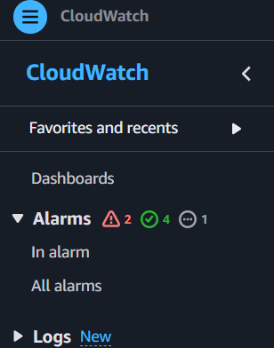
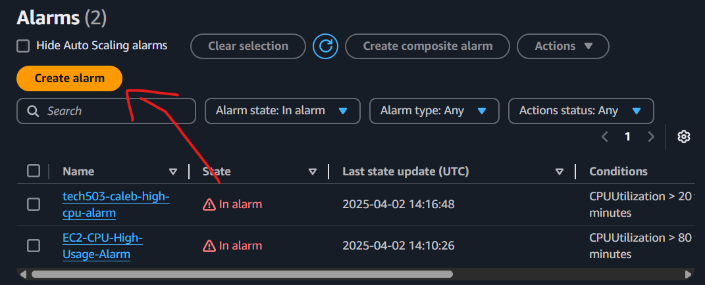
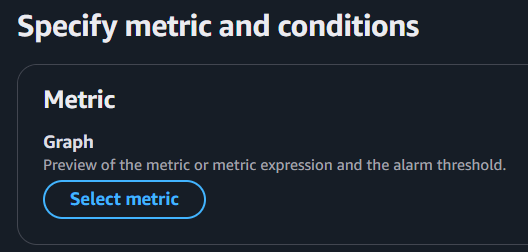
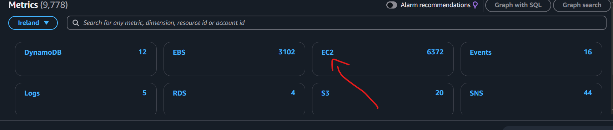
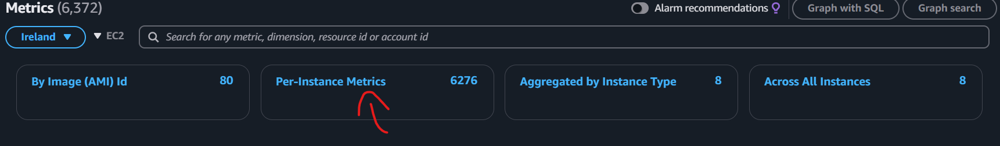
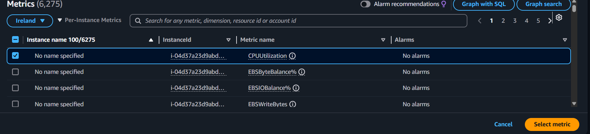
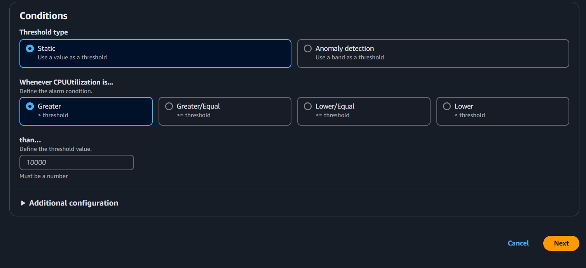
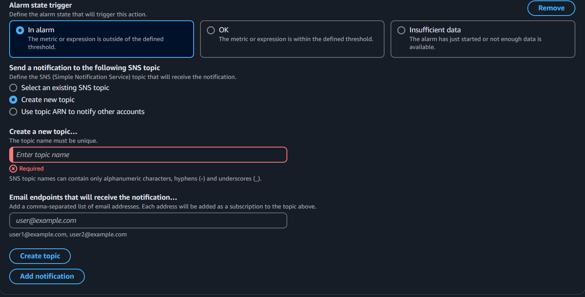
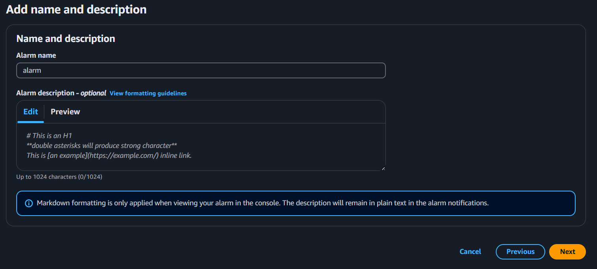
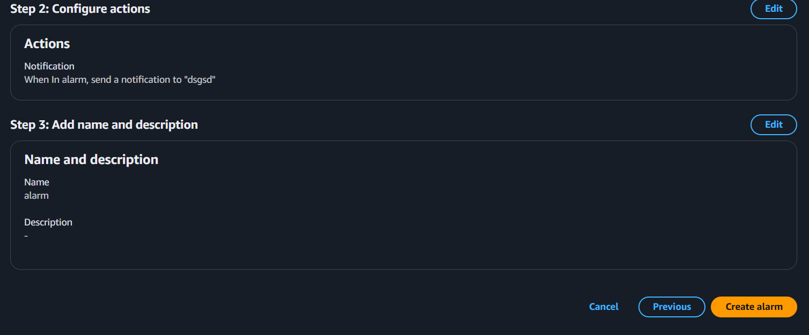

1. Open CloudWatch in AWS Console
    - On the left menu, click Alarms → Create Alarm.

2. click select metric 

  

3. Select EC2.  

  

    - In the search bar, type your EC2 instance ID 

   

    - select cpu utilisation metric- monitors as a % and select metric in bottom right hand corner.

    

4. Set Up Conditions
   - In the conditions section make sure:
        - Threshold type: "Static".
        - configure threshold for metric e.g., cpu>80% 

     

5. Configure Actions (notifications)
   - Under Notification, click Create a new SNS topic.
   - Enter a name for the topic.
   - Enter email address to send the notification to & confirm via link

  

6. Give the alarm a name and description

   

7. Create alarm

   
