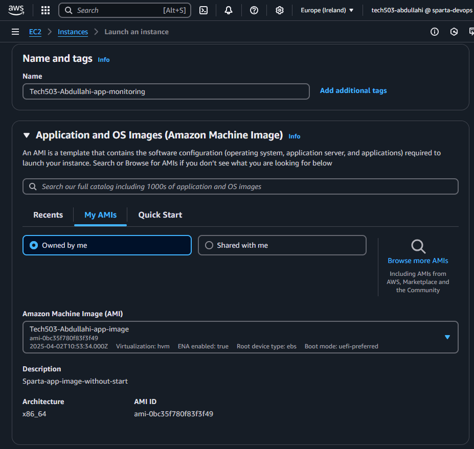
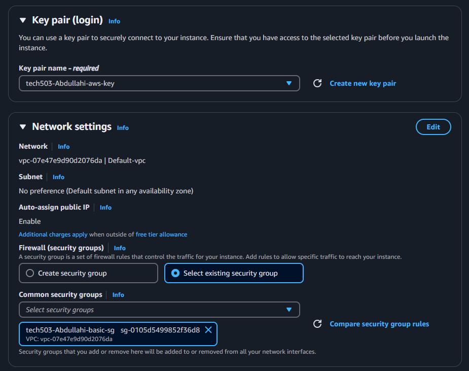
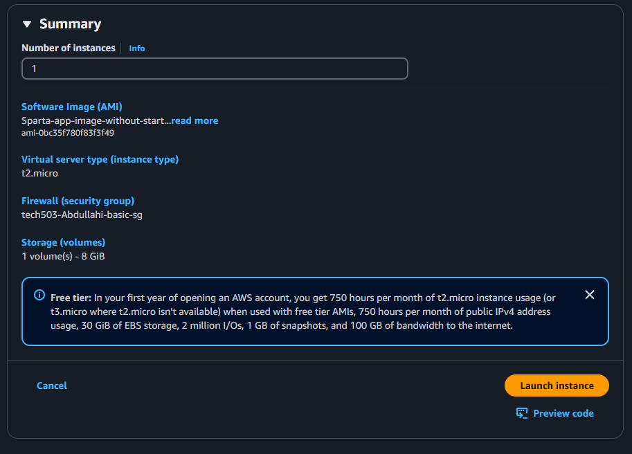
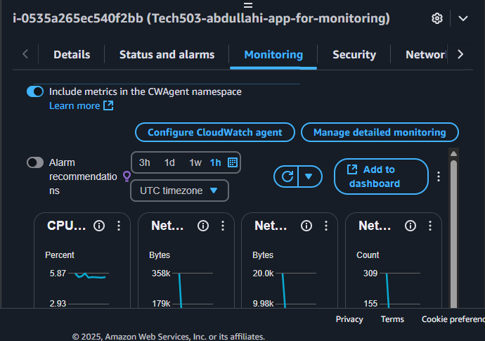
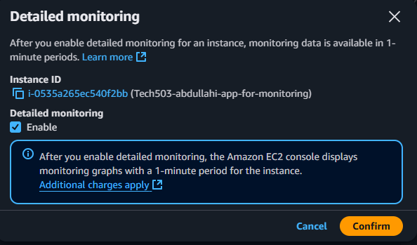
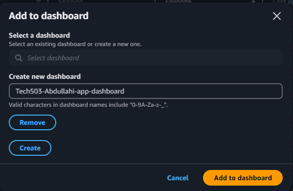

1. Create an ec2 instance
    - manually configure your instance and deploy an application via script or use a pre-configured AMI 
  
    - configure key pair to log in and security groups for the application
  
    - Launch instance.

2. Find instance and select it.
3. scroll down and select monitoring tab
   
4. click manage detailed monitoring and click confirm 
   
5. click add to dashboard 
    
6. create a new dashboard- insert a name and click create then add to dashboard 
   